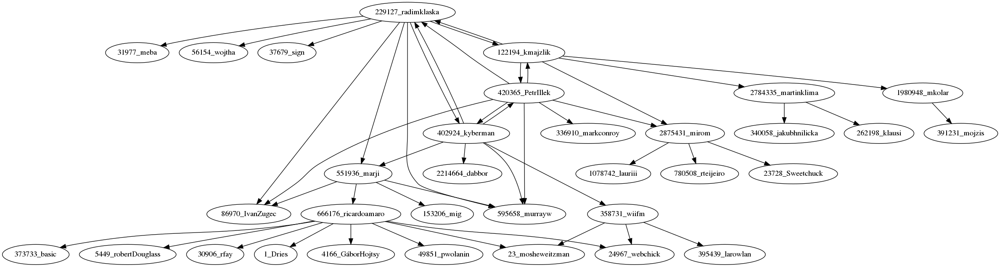

# Drupal.org Mentor graph

Loads mentors using drupal.org API and visualizes the result using graphviz.

## Requirements

* Python to run the code
* graphviz (`sudo apt install graphviz`)
* Uses drupal.org API: https://www.drupal.org/drupalorg/docs/apis/rest-and-other-apis